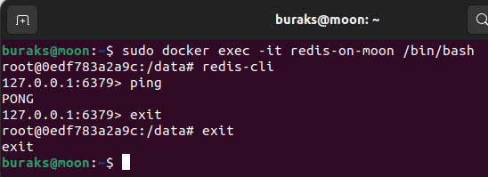
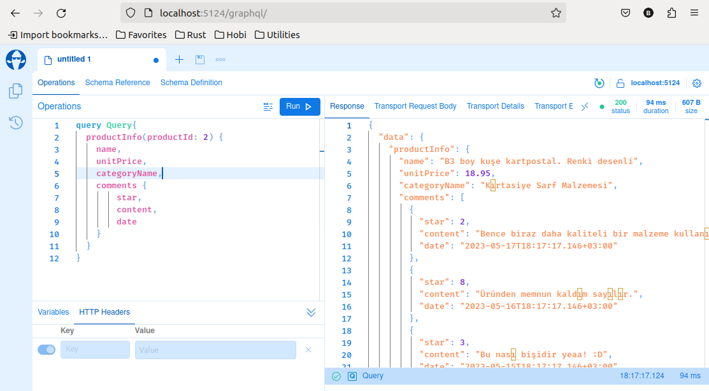
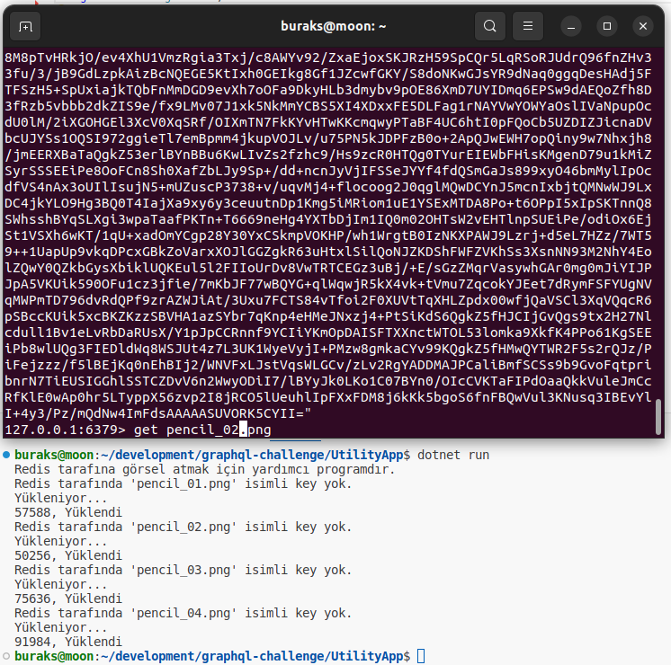
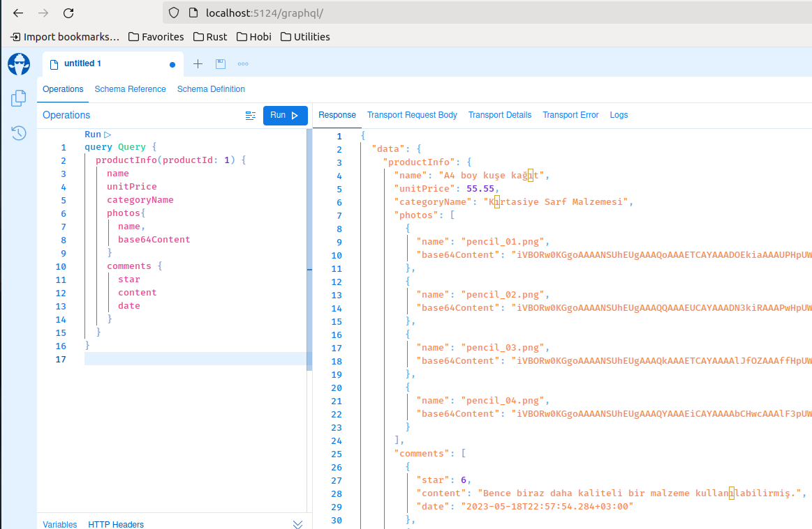

# GraphQL Challenge

Uygulamanın senaryosu şöyle...Bir e-ticaret platformunun servislerinden birisini geliştiriyoruz. Arzu edilen fonksiyonelliklerden birisi, müşterinin baktığı ürüne ait bilgiler haricinde, kullanıcı yorumlarını ve görsellerini de döndürebilmek. Bu veri setini istemci uygulamanın (kuvvetle muhtemel önyüz tarafı) istediği şekilde sorgulayabilmesini istiyoruz. Yani birden fazla resource'u esnek bir şekilde sorgulayabileceğimiz imkanlarımız olsun derdindeyiz. Ürün bilgisinin içeren ana parça Entity Framework odaklı bir veri kaynağı olabilir. Kuvvetle muhtemel Postgresql iyi bir çözüm gibi duruyor. Diğer yandan yorumlar başka bir servisten gelecek. Ayrıca ürün görselleri de fiziki diskten okuma yapan (CDN gibi bölge de olabilir) bir enstrüman üstünden geliyor olabilir ya da minik thumnail görüntüleri olduğunu düşünerek Redis cache sisteminden çekebilirim.

## Ön Hazırlıklar

```bash
# Postgresql tarafı için docker imajı kullanılabilir
sudo docker run --name postgresql -e POSTGRES_USER=scoth -e POSTGRES_PASSWORD=tiger -p 5432:5432 -v /data:/var/lib/postgresql/data -d postgres

# Migration için EF tool'a ihtiyacımız olacaktır
dotnet tool install -g dotnet-ef

# Migration planı oluşturup çalıştırmak için
dotnet ef migrations add InitialCreate
dotnet ef database update

# Redis Cache tarafı için Docker imajını kullanabiliriz
sudo docker run --name redis-on-moon -dp 6378:6379 redis

# Redis'in çalıştığından emin olmak için şöyle ilerlenebilir
sudo docker exec -it redis-on-moon /bin/bash
redis-cli
ping
```



## Örnek Sorgu

GraphQL tarafında aşağıdakine benzer bir sorguyu işletebilmek düşüncesindeyiz.

```graphql
query Query {
  productInfo(productId: 1) {
    name
    unitPrice
    categoryName
    photos{
      name,
      base64Content
    }
    comments {
      star
      content
      date
    }
  }
}
```

İlk sonuçlar fena değil.



## Notlar

UtilityApp isimli uygulama Redis tarafına minik ürün görsellerini nasıl atabileceğimizi test etmek için kullanılmakta. Redis'den çok sık değişmeyeceğini düşündüğümüz ürün görsellerini alabiliriz. Kobay fotoğrafları dağıtık bir cache sisteminden çekmek oldukça mantıklı gibi. Hem Console hem de GraphQL servisi, Redis için NRedisStack isimli Nuget paketini kullanmakta.

```bash
dotnet add package NRedisStack
```

Console uygulaması ile assets klasöründeki kobay 4 fotoğraf redis'e yüklenebiliyor.



## Nasıl Çalıştırırız?

- Öncelikle Postgresql ve Redis container'larının ayakta olduğundan emin olmalıyız.
- Diğer yandan ilk önce CommentService çalıştırılmalıdır.
- Ardından ProductService çalışıtırılır.
- Cache'duran ürün görselleri zaman içinde silinmiş olabilir. Bunları "key yoksa ekle" şeklinde ProductService tarafında da ele alabiliriz ancak amaç var olan dağıtık cache kaynaklarından gelmesini denemektir. Bu nedenle belki UtilityApp'ı bir kere çalıştırmak gerekebilir.

```bash
# Postgresql'i başlat
sudo docker start [container_no]

# Redis'i başlat
sudo docker start [container_no]

# Belki UtilitApp'ı bir kere çalıştırmak gerekebilir
dotnet run

# CommentService'i çalıştır
dotnet run

# ProductService'i çalıştır
dotnet run
```

Nihayetinden aşağıdakine benzer şekilde bir çıktı elde edebilmeliyiz.

